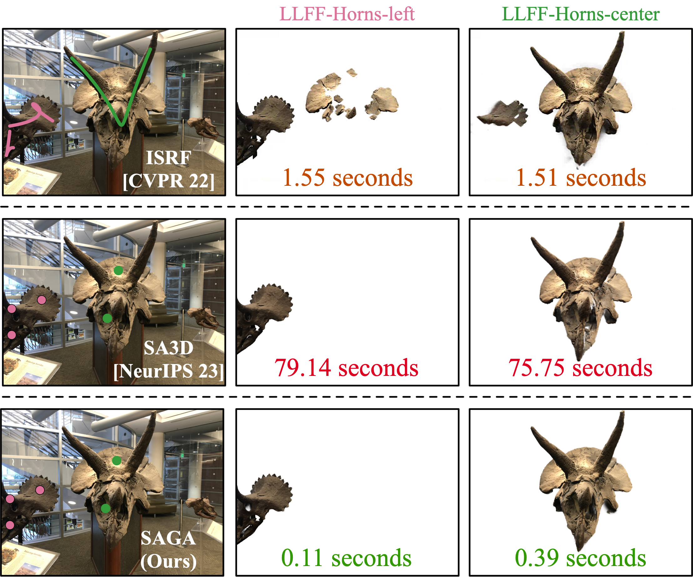
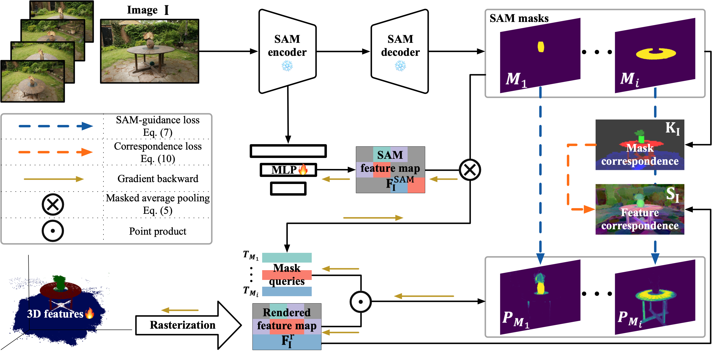

# SAGA
> Note: Please refer to the v2 branch for the newest version of SAGA.

The official implementation of SAGA (Segment Any 3D GAussians). The paper is at [this url](https://jumpat.github.io/SAGA/SAGA_paper.pdf). Please refer to our [project page](https://jumpat.github.io/SAGA/) for more information. 
<br>
<br>
<div align=center>


SAGA can perform fine-grained interactive segmentation for 3D Gaussians within milliseconds.  
</div>
<br>
<br>
<div align=center>

</div>
Given a pre-trained 3DGS model and its training set, we attach a low-dimensional 3D feature to each Gaussian in the model. For every image within the training set, we employ SAM to extract 2D features and a set of masks. Then we render 2D feature maps through the differentiable rasterization and train the attached features with two losses: i.e., the SAM-guidance loss and the correspondence loss. The former adopts SAM features to guide the 3D features to learn 3D segmentation from the ambiguous 2D masks. The latter distills the point-wise correspondence derived from the masks to enhance feature compactness.

# Installation
The installation of SAGA is similar to [3D Gaussian Splatting](https://github.com/graphdeco-inria/gaussian-splatting).
```bash
git clone git@github.com:Jumpat/SegAnyGAussians.git
```
or
```bash
git clone https://github.com/Jumpat/SegAnyGAussians.git
```
Then install the dependencies:
```bash
conda env create --file environment.yml
conda activate gaussian_splatting
```
In default, we use the public ViT-H model for SAM. You can download the pre-trained model from [here](https://dl.fbaipublicfiles.com/segment_anything/sam_vit_h_4b8939.pth) and put it under ./dependencies/sam_ckpt.

## Prepare Data

The used datasets are [360_v2](https://jonbarron.info/mipnerf360/), [nerf_llff_data](https://drive.google.com/drive/folders/14boI-o5hGO9srnWaaogTU5_ji7wkX2S7) and [LERF](https://drive.google.com/drive/folders/1vh0mSl7v29yaGsxleadcj-LCZOE_WEWB?usp=sharing).

The data structure of SAGA is shown as follows:
```
./data
    /360_v2
        /garden
            /images
            /images_2
            /images_4
            /images_8
            /sparse
            /features
            /sam_masks
        ...
    /nerf_llff_data
        /fern
            /images
            /poses_bounds.npy
            /sparse
            /features
            /sam_masks
        /horns
            ...
        ...
    /lerf_data
        ...
```
To get the features and sam_masks, run the following command:
```bash
python extract_features.py --image_root <path to the scene data> --sam_checkpoint_path <path to the pre-trained SAM model> --downsample <1/2/4/8>

python extract_segment_everything_masks.py --image_root <path to the scene data> --sam_checkpoint_path <path to the pre-trained SAM model> --downsample <1/2/4/8>
```
Note that sometimes the downsample is essential due to the limited GPU memory.


## Pre-train the 3D Gaussians
We inherit all attributes from 3DGS, more information about training the Gaussians can be found in their repo.
```bash
python train_scene.py -s <path to COLMAP or NeRF Synthetic dataset>
```

## Train the 3D Gaussian Features
```bash
python train_contrastive_feature.py -m <path to the pre-trained 3DGS model>
```

## 3D Segmentation
Temporarily, 3D segmentation requires jupyter notebook. Please refer to prompt_segmenting.ipynb for instructions.

## Rendering
After running the scripts in prompt_segmenting.ipynb, the bitmap of the Gaussians will be saved as ./segmentation_res/final_mask.pt (you can change it so that the segmentation results of many different objects can be saved). To render the segmentation results (get the segmented object), run the following command:
```bash
python render.py -m <path to the pre-trained 3DGS model> --precomputed_mask <path to the segmentation results> --target scene --segment
```

To get the 2D rendered masks, run the following command:
```bash
python render.py -m <path to the pre-trained 3DGS model> --precomputed_mask <path to the segmentation results> --target seg
```

You can also render the pre-trained 3DGS model without segmentation:
```bash
python render.py -m <path to the pre-trained 3DGS model> --target scene
```

## Citation
If you find this project helpful for your research, please consider citing the report and giving a ⭐.
```BibTex
@article{cen2023saga,
      title={Segment Any 3D Gaussians}, 
      author={Jiazhong Cen and Jiemin Fang and Chen Yang and Lingxi Xie and Xiaopeng Zhang and Wei Shen and Qi Tian},
      year={2023},
      journal={arXiv preprint arXiv:2312.00860},
}
```
