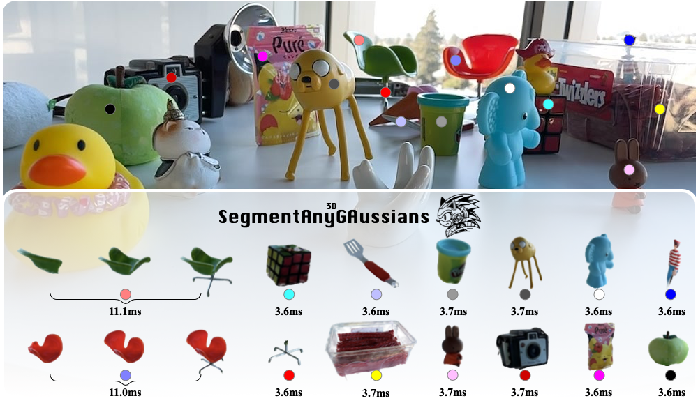

# SAGA

The official implementation of [SAGA (Segment Any 3D GAussians)](https://arxiv.org/abs/2312.00860). 
<!-- Please refer to our [project page](https://jumpat.github.io/SAGA/) for more information.  -->
<br>
<!-- <br> -->
<div align=center>

</div>

# Installation
The installation of SAGA is similar to [3D Gaussian Splatting](https://github.com/graphdeco-inria/gaussian-splatting).
```bash
git clone git@github.com:Jumpat/SegAnyGAussians.git
```
or
```bash
git clone https://github.com/Jumpat/SegAnyGAussians.git
```
Then install the dependencies:
```bash
conda env create --file environment.yml
conda activate gaussian_splatting
```
In default, we use the public ViT-H model for SAM. You can download the pre-trained model from [here](https://dl.fbaipublicfiles.com/segment_anything/sam_vit_h_4b8939.pth) and put it under ./third_party/segment-anything/sam_ckpt.

## Prepare Data

The used datasets are [360_v2](https://jonbarron.info/mipnerf360/), [nerf_llff_data](https://drive.google.com/drive/folders/14boI-o5hGO9srnWaaogTU5_ji7wkX2S7) and [LERF](https://drive.google.com/drive/folders/1vh0mSl7v29yaGsxleadcj-LCZOE_WEWB?usp=sharing).

The data structure of SAGA is shown as follows:
```
./data
    /360_v2
        /garden
            /images
            /images_2
            /images_4
            /images_8
            /sparse
            /features
            /sam_masks
            /mask_scales
        ...
    /nerf_llff_data
        /fern
            /images
            /poses_bounds.npy
            /sparse
            /features
            /sam_masks
            /mask_scales
        /horns
            ...
        ...
    /lerf_data
        ...
```
Since we need the pre-trained 3D-GS model for mask scales extraction, the first step is to train the 3D Gaussians:

## Pre-train the 3D Gaussians
We inherit all attributes from 3DGS, more information about training the Gaussians can be found in their repo.
```bash
python train_scene.py -s <path to COLMAP or NeRF Synthetic dataset>
```

## Prepare data
Then, to get the sam_masks and corresponding mask scales, run the following command:
```bash
python extract_segment_everything_masks.py --image_root <path to the scene data> --sam_checkpoint_path <path to the pre-trained SAM model> --downsample <1/2/4/8>
python get_scale.py --image_root <path to the scene data> --model_path <path to the pre-trained 3DGS model>
```
Note that sometimes the downsample is essential due to the limited GPU memory.

If you want to try the open-vocabulary segmentation, extract the CLIP features first:
```bash
python get_clip_features.py --image_root <path to the scene data>
```

## Train 3D Gaussian Affinity Features
```bash
python train_contrastive_feature.py -m <path to the pre-trained 3DGS model> --iterations 10000 --num_sampled_rays 1000
```

## 3D Segmentation
Currently SAGA provides an interactive GUI (saga_gui.py) implemented with dearpygui and a jupyter-notebook (prompt_segmenting.ipynb). To run the GUI:
```bash
python saga_gui.py --model_path <path to the pre-trained 3DGS model>
```
Temporarily, open-vocabulary segmentation is only implemented in the jupyter notebook. Please refer to prompt_segmenting.ipynb for detailed instructions.


## Rendering
After saving segmentation results in the interactive GUI or running the scripts in prompt_segmenting.ipynb, the bitmap of the Gaussians will be saved in ./segmentation_res/\<name>.pt (you can set the name by yourself). To render the segmentation results on training views (get the segmented object by removing the background), run the following command:
```bash
python render.py -m <path to the pre-trained 3DGS model> --precomputed_mask <path to the segmentation results> --target scene --segment
```

To get the 2D rendered masks, run the following command:
```bash
python render.py -m <path to the pre-trained 3DGS model> --precomputed_mask <path to the segmentation results> --target seg
```

You can also render the pre-trained 3DGS model without segmentation:
```bash
python render.py -m <path to the pre-trained 3DGS model> --target scene
```

## Citation
If you find this project helpful for your research, please consider citing the report and giving a ⭐.
```BibTex
@article{cen2023saga,
      title={Segment Any 3D Gaussians}, 
      author={Jiazhong Cen and Jiemin Fang and Chen Yang and Lingxi Xie and Xiaopeng Zhang and Wei Shen and Qi Tian},
      year={2023},
      journal={arXiv preprint arXiv:2312.00860},
}
```

## Acknowledgement
The implementation of saga refers to [GARField](https://github.com/chungmin99/garfield.git), [OmniSeg3D](https://github.com/OceanYing/OmniSeg3D-GS), [Gaussian Splatting](https://github.com/graphdeco-inria/gaussian-splatting), and we sincerely thank them for their contributions to the community.
